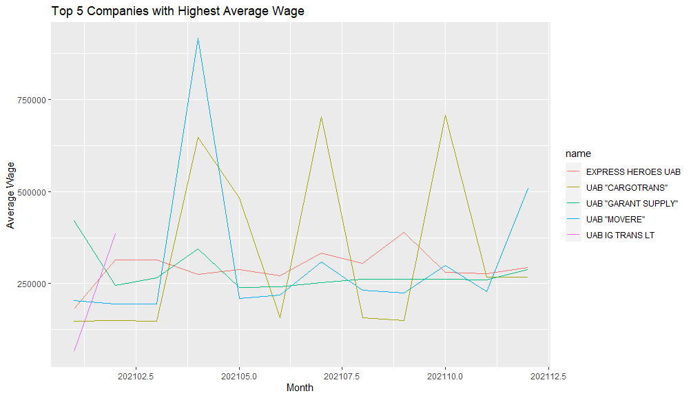
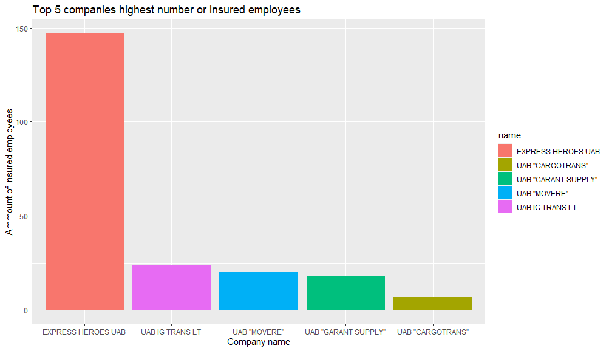

# R Laboratorinis darbas: duomenų vizualizacija

| Variantas | ecoActCode |
| --------- | ---------- |
|     2     |   494100   |

### 1. Užduotis

Atsakymas:

Išvados: Daugiausia žmonių gauna atlyginimus tarp 10 tūkst. ir 150 tūkst.  Didžiausi atlyginimai siekia virš 750 tūkst. Labai netolygus atlyginimų pasiskirstymas.

### 2. Užduotis

Atsakymas:

Išvados:

### 3. Užduotis

Atsakymas:

Išvados:

### 4. Užduotis

Shiny R aplikacijos nuotrauka:

